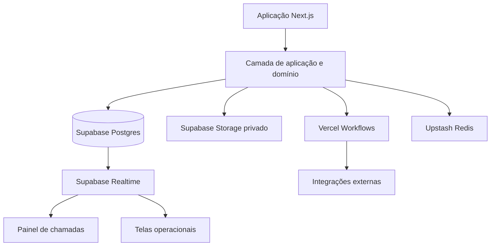

# UNIMETRA — ESPECIFICAÇÃO COMPLETA DO SISTEMA DE GESTÃO E ATENDIMENTO EM SAÚDE OCUPACIONAL

**Documento-mestre para desenvolvimento no Cursor**  
**Versão:** 1.0  
**Data-base:** 12/07/2026  
**Idioma da aplicação:** Português do Brasil  
**Fuso padrão inicial:** America/Fortaleza  
**Arquitetura recomendada:** Next.js + Vercel + Supabase + GitHub

---

## 0. INSTRUÇÃO PRINCIPAL AO CURSOR

Este documento é a fonte de verdade funcional e arquitetural do sistema de atendimento ocupacional da Unimetra.

Antes de escrever código:

1. Leia todo este documento.
2. Analise o repositório atual por completo.
3. Não altere o site público da Unimetra sem necessidade explícita.
4. Não apague, renomeie ou substitua funcionalidades existentes sem mapear impacto.
5. Não crie todas as funcionalidades de uma só vez.
6. Implemente por fases, com migrations pequenas, reversíveis e testadas.
7. Antes de cada fase, registre o plano em `docs/implementation/`.
8. Depois de cada fase, execute lint, TypeScript, testes unitários, testes de integração e build.
9. Nunca use dados reais de pacientes em desenvolvimento, seed, preview, logs ou testes.
10. Nunca coloque chave secreta, senha, token ou credencial no código-fonte.
11. Nenhuma regra clínica pode ser inventada pela IA. Regras médicas devem ser configuráveis e aprovadas por profissional responsável.
12. Nenhuma conclusão de aptidão, diagnóstico ou interpretação médica pode ser automatizada como decisão final.
13. Operações clínicas críticas devem ocorrer no backend, nunca diretamente do navegador para o banco.
14. O histórico clínico e os documentos emitidos devem ser imutáveis e versionados.
15. Toda ação sensível deve gerar auditoria.
16. Toda tabela de negócio deve ser multi-tenant e possuir `tenant_id`, salvo tabelas globais expressamente documentadas.
17. Toda consulta deve respeitar tenant, unidade, perfil e permissões.
18. O sistema deve falhar de forma segura: uma falha nunca pode gerar ASO incompleto, atendimento duplicado ou perda silenciosa de dados.
19. Em caso de dúvida entre conveniência e integridade clínica, priorize integridade, rastreabilidade e segurança.
20. Não utilizar excesso de cards. Preferir tabelas, filas, listas, barras de progresso, formulários estruturados e painéis operacionais compactos.

### Entregáveis obrigatórios antes da primeira implementação

Criar e manter:

- `docs/architecture/system-overview.md`
- `docs/architecture/domain-model.md`
- `docs/architecture/security-model.md`
- `docs/architecture/realtime-and-queues.md`
- `docs/architecture/document-generation.md`
- `docs/database/schema.dbml`
- `docs/database/data-dictionary.md`
- `docs/permissions/permission-matrix.md`
- `docs/workflows/encounter-state-machine.md`
- `docs/workflows/patient-call-flow.md`
- `docs/testing/test-strategy.md`
- `docs/operations/backup-and-recovery.md`
- `docs/operations/incident-response.md`
- `docs/decisions/` com ADRs para decisões importantes

---

# 1. VISÃO DO PRODUTO

A plataforma Unimetra deverá gerenciar toda a operação de uma clínica de saúde ocupacional, desde o cadastro do contrato empresarial e do PCMSO até o atendimento, exames, consulta, emissão de documentos, faturamento, auditoria e entrega segura dos resultados.

O sistema será inicialmente utilizado pela própria Unimetra, mas deve nascer preparado para ser comercializado como SaaS para outras clínicas.

## 1.1 Objetivos principais

- Receber encaminhamentos de empresas.
- Identificar automaticamente os exames necessários conforme empresa, unidade, setor, função, GHE, riscos, PCMSO e tipo de exame ocupacional.
- Evitar seleção manual incorreta de exames pela recepção.
- Organizar o paciente em um fluxo de atendimento por etapas.
- Exibir filas por setor e por sala.
- Permitir chamada do paciente em painel de TV, com nome ou senha e orientação para a sala.
- Registrar triagem, consulta e resultados de exames complementares.
- Gerar ASO, fichas, laudos, declarações e documentos já preenchidos.
- Preservar o histórico exato da versão do PCMSO, riscos, exames e modelos utilizados.
- Permitir impressão, assinatura, reimpressão e retificação controlada.
- Disponibilizar portal para empresas, conforme permissões e regras de privacidade.
- Integrar futuramente com eSocial, laboratórios, equipamentos e sistemas externos.
- Garantir isolamento entre clínicas clientes, empresas e unidades.
- Disponibilizar auditoria completa e mecanismos de recuperação de falhas.

## 1.2 Princípio central

O sistema não deve tratar um atendimento apenas como um status único. Cada atendimento deve possuir um roteiro individual de etapas, calculado no momento do check-in e preservado como snapshot.

Exemplo:

```text
Recepção
→ Triagem
→ Acuidade visual
→ Audiometria
→ Espirometria
→ Laboratório
→ Consulta ocupacional
→ Conclusão médica
→ Geração/assinatura do ASO
→ Entrega e encerramento
```

Cada paciente pode ter um roteiro diferente.

---

# 2. ESCOPO DO SISTEMA

## 2.1 Aplicações previstas

1. **Sistema interno da clínica**  
   Recepção, triagem, consultório, exames, gestão, documentos, financeiro e administração.

2. **Painel de chamadas**  
   Tela em TV ou monitor para exibir e anunciar pacientes e destinos.

3. **Portal da empresa cliente**  
   Cadastro e acompanhamento de trabalhadores, encaminhamentos, agendamento e acesso a documentos permitidos.

4. **Portal do paciente — fase posterior**  
   Acesso controlado a documentos, orientações e histórico permitido.

5. **Administração da plataforma SaaS**  
   Gestão das clínicas clientes, planos, limites, suporte, incidentes e configuração global.

6. **Conector local — fase posterior**  
   Aplicativo instalado na clínica para impressão silenciosa, leitura de pastas, integração com equipamentos e contingência limitada.

## 2.2 Fora do escopo inicial

- Diagnóstico médico automático.
- Decisão automática de aptidão ou inaptidão.
- Prontuário totalmente offline.
- Integração universal com qualquer equipamento sem SDK ou documentação do fabricante.
- Importação automática perfeita de qualquer DOCX/PDF sem etapa de configuração e validação.
- Substituição da análise jurídica, médica, de LGPD ou de segurança da informação.

---

# 3. ARQUITETURA RECOMENDADA

## 3.1 Stack

- Next.js com App Router.
- TypeScript em modo estrito.
- React.
- Vercel para aplicação, funções, previews e observabilidade.
- Supabase Postgres como banco principal.
- Supabase Auth para autenticação.
- Supabase Realtime Broadcast para chamadas e atualizações instantâneas.
- Supabase Storage com buckets privados para documentos.
- Drizzle ORM para schema, queries e migrations.
- Zod para validação de entrada e saída.
- Vercel Workflows para processos duráveis e reprocessáveis.
- Upstash Redis para rate limiting, locks curtos, cache e controle de frequência.
- Sentry ou solução equivalente para erros e tracing.
- GitHub para versionamento, pull requests e CI/CD.
- Playwright para testes end-to-end.
- Vitest para testes unitários e integração.

## 3.2 Modelo arquitetural

Adotar **monólito modular**. Não iniciar com microserviços.



## 3.3 Separação de camadas

```text
Interface
→ Server Actions / Route Handlers
→ validação de autenticação e autorização
→ serviço de aplicação
→ regras de domínio
→ repositório/ORM
→ PostgreSQL
```

Não colocar regra clínica crítica diretamente em componentes React.

## 3.4 Regiões

- Criar o Supabase preferencialmente na região `sa-east-1` — São Paulo.
- Configurar as funções da Vercel em região compatível/próxima.
- Evitar chamadas repetidas entre regiões distantes.
- Registrar a decisão em ADR.

---

# 4. MULTITENANCY

## 4.1 Conceito

Cada clínica cliente é um `tenant`.

Exemplos:

- Tenant Unimetra.
- Tenant Clínica Ocupacional X.
- Tenant Medicina do Trabalho Y.

Todas as entidades da clínica devem estar isoladas por `tenant_id`.

## 4.2 Estrutura

```text
tenant
└── clinic_units
    ├── rooms
    ├── workstations
    ├── professionals
    ├── companies
    └── encounters
```

## 4.3 Regras obrigatórias

- `tenant_id` não pode vir livremente do formulário do usuário.
- O backend resolve o tenant pela sessão e pelo vínculo ativo.
- Toda query precisa filtrar pelo tenant.
- RLS deve reforçar o isolamento no banco.
- IDs devem ser UUID/UUIDv7 ou equivalente seguro.
- Não usar IDs sequenciais expostos como controle de autorização.
- Usuário pode pertencer a mais de um tenant, desde que haja vínculo separado.
- Troca de tenant deve exigir seleção explícita e registrar auditoria.

## 4.4 Tabelas centrais

- `tenants`
- `tenant_settings`
- `tenant_subscriptions`
- `tenant_memberships`
- `clinic_units`
- `rooms`
- `workstations`

---

# 5. AUTENTICAÇÃO, PERFIS E PERMISSÕES

## 5.1 Autenticação

Usar Supabase Auth com:

- e-mail e senha;
- recuperação segura de senha;
- verificação de e-mail;
- MFA obrigatório para perfis críticos;
- expiração e renovação segura de sessão;
- invalidação de sessão ao bloquear usuário;
- política de senha configurável;
- proteção contra força bruta e rate limiting;
- log de login, falha, logout e recuperação.

## 5.2 Perfis sugeridos

- `platform_super_admin`
- `tenant_admin`
- `unit_manager`
- `receptionist`
- `nurse`
- `nursing_technician`
- `occupational_physician`
- `physician`
- `audiologist`
- `exam_technician`
- `laboratory_technician`
- `psychologist`
- `radiology_operator`
- `document_operator`
- `finance_operator`
- `company_manager`
- `company_requester`
- `auditor_readonly`
- `support_restricted`
- `panel_device`

## 5.3 Modelo de permissão

Não usar somente perfil fixo. Combinar:

- papel padrão;
- permissões granulares;
- escopo do tenant;
- escopo da unidade;
- escopo da empresa;
- escopo profissional;
- restrições de dados clínicos;
- MFA/AAL necessário para ação crítica.

Exemplo de permissões:

```text
companies.read
companies.create
companies.update
workers.read
workers.create
encounters.check_in
encounters.cancel
triage.write
clinical_records.read
clinical_records.write
exam_results.write.audiometry
exam_results.write.spirometry
medical_consultation.write
aso.conclude
aso.sign
aso.reprint
documents.view_sensitive
documents.download
billing.read
billing.write
audit.read
settings.manage
```

## 5.4 Regras críticas

- Recepção não acessa conclusão médica detalhada.
- Empresa não acessa prontuário clínico completo.
- Técnico vê apenas exames compatíveis com sua atuação e fila.
- Médico vê dados necessários ao atendimento e conclusão.
- Administrador técnico não deve automaticamente possuir acesso clínico irrestrito.
- Suporte da plataforma não acessa dados clínicos por padrão.
- Acesso emergencial deve exigir justificativa e gerar alerta/auditoria.

---

# 6. CADASTRO DA CLÍNICA

## 6.1 Tenant

Campos mínimos:

- razão social;
- nome fantasia;
- CNPJ;
- endereço;
- contatos;
- responsável;
- logomarca;
- timezone;
- idioma;
- configurações de privacidade;
- configurações de documentos;
- configurações de chamada;
- status do tenant;
- plano contratado.

## 6.2 Unidades

- nome;
- código interno;
- CNPJ/estabelecimento;
- endereço;
- telefone;
- horário de atendimento;
- responsável;
- status;
- configuração de filas;
- configuração de documentos;
- configuração de impressão.

## 6.3 Salas

- nome público: `Sala 03`;
- descrição: `Audiometria`;
- tipo da sala;
- unidade;
- procedimentos permitidos;
- status ativa/inativa;
- prioridade;
- texto de chamada;
- localização/orientação;
- dispositivo associado.

## 6.4 Estações de trabalho

Permitir vincular uma estação ou sessão a uma sala.

Exemplo:

```text
Usuária: Fonoaudióloga Ana
Estação: AUD-01
Sala: Sala 03 — Audiometria
```

Ao clicar em chamar, o destino já vem preenchido.

---

# 7. EMPRESAS CLIENTES

## 7.1 Estrutura

```text
Empresa
└── Estabelecimentos
    └── Setores
        └── Funções
            └── GHE/Grupo de exposição
                └── Riscos
                    └── Protocolos de exames
```

## 7.2 Cadastro de empresa

Campos:

- razão social;
- nome fantasia;
- CNPJ;
- inscrição;
- endereço;
- CNAE;
- grau de risco;
- contatos;
- responsável administrativo;
- responsável de SST;
- médico responsável pelo PCMSO;
- contrato;
- forma de cobrança;
- tabela de preços;
- validade contratual;
- status;
- observações;
- documentos anexos.

## 7.3 Estabelecimentos

Uma empresa pode possuir várias unidades, CNPJs, obras ou locais.

Campos:

- empresa;
- CNPJ/CAEPF/CNO quando aplicável;
- nome;
- endereço;
- código eSocial;
- CNAE;
- grau de risco;
- responsável;
- status.

## 7.4 Setores, funções e vínculos

- Setor deve pertencer ao estabelecimento.
- Função pode ser global à empresa ou específica do estabelecimento.
- Trabalhador deve possuir vínculo empregatício versionado.
- Mudança de função/setor não apaga histórico.
- Um trabalhador pode ter múltiplos vínculos históricos.

---

# 8. TRABALHADORES E VÍNCULOS

## 8.1 Trabalhador

Campos mínimos:

- nome completo;
- nome social;
- CPF;
- data de nascimento;
- sexo cadastral quando necessário;
- identidade;
- telefone;
- e-mail;
- endereço;
- nome da mãe quando necessário;
- dados de acessibilidade;
- foto opcional;
- consentimentos e avisos de privacidade;
- status de cadastro.

## 8.2 Vínculo empregatício

- empresa;
- estabelecimento;
- matrícula;
- data de admissão;
- data de desligamento;
- setor;
- função;
- GHE;
- categoria;
- regime;
- status;
- histórico de alterações.

## 8.3 Identificação e duplicidade

- CPF deve ser único por pessoa na plataforma, com regras de visibilidade por tenant.
- Permitir trabalhadores sem CPF somente mediante justificativa e identificador alternativo.
- Usar busca normalizada por CPF, nome, matrícula e data de nascimento.
- Detectar possíveis duplicidades antes de criar.
- Mesclagem de cadastros somente por usuário autorizado, com auditoria e possibilidade de rastrear origem.

---

# 9. PCMSO, PGR, GHE, RISCOS E PROTOCOLOS

## 9.1 Versionamento obrigatório

PCMSO deve possuir:

- código;
- empresa/estabelecimento;
- versão;
- vigência inicial;
- vigência final;
- médico responsável;
- CRM/UF;
- documento original;
- status rascunho/em revisão/aprovado/ativo/encerrado;
- data de aprovação;
- responsável pela ativação;
- histórico de versões.

Nunca editar retroativamente uma versão já utilizada em atendimento.

## 9.2 Riscos ocupacionais

Catálogo configurável:

- físico;
- químico;
- biológico;
- ergonômico;
- acidente/mecânico;
- outros conforme regra técnica.

Campos:

- agente;
- descrição;
- código aplicável;
- fonte geradora;
- intensidade/concentração quando aplicável;
- técnica de avaliação;
- medidas de controle;
- EPI/EPC;
- periodicidade;
- observações.

## 9.3 GHE e associação

- GHE pertence a empresa/estabelecimento.
- Pode vincular funções, setores e riscos.
- A associação deve ser versionada.
- Atendimento deve guardar snapshot dos riscos vigentes.

## 9.4 Protocolos de exames

Um protocolo define exames por:

- empresa;
- estabelecimento;
- função;
- GHE;
- risco;
- tipo de exame ocupacional;
- sexo/idade quando tecnicamente aplicável e configurado;
- periodicidade;
- condição ou exceção;
- vigência;
- versão do PCMSO.

Tipos ocupacionais iniciais:

- admissional;
- periódico;
- retorno ao trabalho;
- mudança de risco ocupacional;
- demissional;
- avaliação específica;
- consulta avulsa;
- outros configuráveis.

## 9.5 Motor de cálculo de exames

No check-in, o sistema deve:

1. localizar vínculo ativo;
2. localizar PCMSO vigente na data de referência;
3. localizar função, setor, GHE e riscos vigentes;
4. encontrar protocolo compatível;
5. calcular exames obrigatórios;
6. aplicar inclusões e exceções configuradas;
7. apontar conflitos ou ausência de protocolo;
8. exigir resolução autorizada se houver inconsistência;
9. criar snapshot completo;
10. gerar etapas e solicitações.

Não aceitar silêncio em caso de ausência de protocolo. O sistema deve bloquear e mostrar pendência.

## 9.6 Override manual

Inclusão ou remoção manual de exame exige:

- permissão;
- justificativa;
- usuário;
- data/hora;
- referência técnica/médica quando aplicável;
- auditoria;
- indicação no snapshot;
- destaque no atendimento.

---

# 10. CATÁLOGO DE EXAMES E SERVIÇOS

## 10.1 Entidade `exam_catalog`

Campos:

- código interno;
- nome;
- nome curto;
- categoria;
- subcategoria;
- código eSocial/TUSS/outro quando aplicável;
- tipo de resultado;
- unidade de medida;
- exige laudo;
- exige assinatura;
- exige equipamento;
- sala recomendada;
- duração padrão;
- preparo;
- validade do resultado;
- permite resultado externo;
- ativo;
- configurações JSON versionadas.

## 10.2 Categorias iniciais

- consulta clínica ocupacional;
- triagem;
- audiometria;
- espirometria;
- acuidade visual;
- eletrocardiograma;
- eletroencefalograma;
- avaliação psicossocial;
- avaliação psicológica quando aplicável;
- laboratório;
- toxicologia;
- radiologia;
- exame complementar externo;
- vacinação;
- outros.

## 10.3 Pacotes

Pacotes não substituem protocolos clínicos.

Um pacote comercial pode agrupar serviços para preço e orçamento, mas o atendimento deve continuar vinculado aos exames clínicos calculados pelo PCMSO.

Entidades:

- `service_packages`
- `service_package_items`
- `company_package_assignments`
- `company_price_lists`
- `company_price_list_items`

---

# 11. ENCAMINHAMENTOS E PRÉ-ENCAMINHAMENTOS

## 11.1 Origem

- portal da empresa;
- recepção;
- importação CSV/XLSX;
- API externa;
- integração;
- conversão de pré-encaminhamento.

## 11.2 Dados

- empresa;
- estabelecimento;
- trabalhador;
- vínculo;
- tipo ocupacional;
- função/setor/GHE informados;
- data solicitada;
- observação;
- anexos;
- solicitante;
- status;
- divergências detectadas;
- exames previstos em prévia;
- validade do encaminhamento.

## 11.3 Estados

```text
DRAFT
SUBMITTED
VALIDATING
PENDING_CORRECTION
APPROVED
SCHEDULED
CHECKED_IN
CANCELLED
EXPIRED
```

## 11.4 Importação em lote

- template oficial de planilha;
- validação antes de gravar;
- relatório por linha;
- prévia;
- importação idempotente;
- deduplicação;
- possibilidade de corrigir somente linhas inválidas;
- nunca importar parcialmente sem relatório claro.

---

# 12. AGENDA

## 12.1 Recursos

- agenda por unidade;
- agenda por profissional;
- agenda por sala;
- agenda por procedimento;
- encaixe;
- bloqueio de horário;
- feriados;
- capacidade por faixa;
- overbooking configurável;
- status de confirmação;
- cancelamento e reagendamento;
- lista de espera;
- orientações de preparo;
- lembretes.

## 12.2 Estados do agendamento

```text
SCHEDULED
CONFIRMED
ARRIVED
CHECKED_IN
IN_SERVICE
COMPLETED
NO_SHOW
CANCELLED
RESCHEDULED
```

## 12.3 Regras

- Não permitir choque de sala ou profissional, salvo permissão/configuração.
- Não criar atendimento clínico apenas ao abrir agendamento.
- O atendimento nasce no check-in ou por fluxo expressamente configurado.
- Cancelamento do agendamento não apaga histórico.

---

# 13. CHECK-IN E ABERTURA DO ATENDIMENTO

## 13.1 Tela da recepção

Mostrar:

- busca rápida do paciente;
- agenda do dia;
- encaminhamentos aguardando;
- divergências;
- pendências cadastrais;
- empresa e função;
- tipo de exame;
- previsão de exames;
- termos e confirmações;
- ação de check-in.

Evitar excesso de cards. Usar tabela operacional com filtros e painel lateral/drawer para detalhes.

## 13.2 Transação atômica

O check-in deve ocorrer em uma única transação:

1. validar sessão e permissão;
2. bloquear agendamento/encaminhamento;
3. validar que não existe atendimento ativo duplicado;
4. resolver PCMSO e protocolo;
5. criar `encounter`;
6. criar `encounter_snapshot`;
7. criar `exam_orders`;
8. criar `encounter_steps`;
9. criar ticket da primeira fila;
10. registrar auditoria;
11. registrar evento outbox;
12. atualizar agendamento/encaminhamento.

Se qualquer etapa falhar, realizar rollback integral.

## 13.3 Chave de idempotência

Exemplo:

```text
checkin:appointment:<appointment_id>
```

Repetir a solicitação não pode criar outro atendimento.

---

# 14. MÁQUINA DE ESTADOS DO ATENDIMENTO

## 14.1 Estado do atendimento

```text
CREATED
CHECKED_IN
IN_PROGRESS
WAITING_MEDICAL_REVIEW
WAITING_SIGNATURE
COMPLETED
CANCELLED
REOPENED
```

## 14.2 Estado das etapas

```text
PENDING
BLOCKED
READY
QUEUED
CALLED
IN_PROGRESS
COMPLETED
REPEAT_REQUIRED
SKIPPED
CANCELLED
```

## 14.3 Dependências

Cada etapa possui:

- `depends_on_steps`;
- obrigatória ou opcional;
- ordem sugerida;
- grupo paralelo;
- sala/procedimento;
- regra de liberação;
- regra de conclusão;
- profissional necessário;
- motivo de bloqueio.

Exemplo:

```text
Consulta ocupacional
bloqueada até:
- triagem concluída;
- exames obrigatórios concluídos ou formalmente pendentes com decisão médica;
- dados do vínculo confirmados.
```

## 14.4 Recalcular fluxo

Após conclusão, repetição, cancelamento autorizado ou inclusão de exame:

- recalcular etapas liberadas;
- nunca apagar etapa já executada;
- gerar nova etapa quando necessário;
- registrar causa;
- atualizar filas;
- publicar evento.

## 14.5 Encerramento

Atendimento somente pode ser encerrado se:

- etapas obrigatórias concluídas ou justificadamente dispensadas;
- conclusão médica registrada quando aplicável;
- documentos obrigatórios gerados;
- assinaturas obrigatórias realizadas;
- pendências explicitamente resolvidas;
- cobrança consolidada;
- auditoria registrada.

---

# 15. FILAS OPERACIONAIS

## 15.1 Filas

Cada sala ou área possui fila:

- recepção;
- triagem;
- audiometria;
- espirometria;
- acuidade;
- laboratório;
- ECG;
- consultório;
- documentação;
- outras configuráveis.

## 15.2 Ticket

Campos:

- tenant;
- unidade;
- atendimento;
- etapa;
- fila;
- prioridade;
- posição lógica;
- horário de entrada;
- status;
- sala atribuída;
- chamado em;
- iniciado em;
- concluído em;
- quantidade de chamadas;
- motivo de prioridade;
- usuário responsável.

## 15.3 Prioridade

Configuração compatível com política da clínica:

- normal;
- preferencial;
- urgência operacional;
- retorno rápido;
- prioridade manual justificada.

Não expor motivo sensível na TV.

## 15.4 Ordenação

Considerar:

- prioridade;
- horário agendado;
- horário de chegada;
- dependências concluídas;
- capacidade da sala;
- jejum/preparo;
- regras configuradas.

Toda reordenação manual exige permissão e auditoria.

---

# 16. CHAMADA DO PACIENTE NA TELA E DIRECIONAMENTO PARA SALA

## 16.1 Fluxo funcional

1. Profissional abre a fila da sala.
2. Seleciona o próximo paciente.
3. Clica em `Chamar`.
4. Backend valida fila, etapa, sala e concorrência.
5. Backend atualiza ticket e cria `call_event` em transação.
6. Após commit, publica evento privado no Supabase Realtime.
7. Painel da unidade recebe o evento.
8. Painel toca sinal, exibe nome/senha e sala.
9. Painel usa voz para anunciar.
10. Painel confirma recebimento/exibição.
11. Profissional visualiza confirmação.
12. Ao chegar, profissional clica `Paciente compareceu` ou `Iniciar atendimento`.

## 16.2 Ações

- Chamar.
- Rechamar.
- Confirmar comparecimento.
- Iniciar atendimento.
- Devolver à fila.
- Marcar não comparecimento.
- Redirecionar para outra sala.
- Encerrar chamada.
- Chamar próximo.

## 16.3 Privacidade

Modos configuráveis:

- nome completo;
- primeiro nome e inicial;
- nome reduzido;
- nome + senha;
- somente senha.

Padrão recomendado:

```text
MARIA S.
SALA 03 — AUDIOMETRIA
```

O payload da TV não pode conter CPF, empresa, exames, diagnóstico, resultado ou dado clínico.

## 16.4 Realtime

Canal privado por tenant e unidade:

```text
clinic:<tenant_id>:unit:<unit_id>:calls
```

Eventos:

```text
patient.called
patient.recalled
call.cancelled
panel.status
panel.acknowledged
```

O banco é a fonte oficial. Realtime é transporte de baixa latência.

## 16.5 Recuperação

Ao conectar/reconectar, o painel deve:

- autenticar dispositivo;
- carregar chamada ativa;
- carregar últimas chamadas;
- registrar heartbeat;
- inscrever-se no canal;
- verificar áudio;
- informar status online.

Além do Realtime, realizar reconciliação periódica.

## 16.6 Voz

MVP:

- Web Speech API/SpeechSynthesis;
- idioma `pt-BR`;
- velocidade e voz configuráveis;
- fila de áudio;
- prevenção de sobreposição;
- botão inicial `Ativar painel e áudio`;
- fallback visual quando áudio falhar.

Texto padrão:

```text
“Maria, dirija-se à Sala três, Audiometria.”
```

## 16.7 Concorrência

Usar atualização condicional/lock:

```sql
UPDATE queue_tickets
SET status = 'CALLED', room_id = $room_id, called_at = now()
WHERE id = $ticket_id
  AND status IN ('QUEUED', 'READY');
```

Se zero linhas forem alteradas, informar que o paciente já foi chamado ou mudou de estado.

## 16.8 Tabelas

- `queue_definitions`
- `queue_tickets`
- `call_events`
- `call_deliveries`
- `display_panels`
- `display_panel_sessions`
- `display_panel_heartbeats`

---

# 17. TRIAGEM

## 17.1 Formulário versionado

A triagem deve ser configurável e versionada.

Possíveis campos:

- pressão arterial;
- frequência cardíaca;
- frequência respiratória;
- temperatura;
- saturação;
- peso;
- altura;
- IMC calculado;
- glicemia quando aplicável;
- queixa atual;
- uso de medicação;
- alergias;
- observações;
- intercorrência;
- encaminhamento imediato.

## 17.2 Regras

- Registrar profissional, conselho quando aplicável, data e hora.
- Guardar valores originais.
- Alteração posterior gera versão/correção, não sobrescrita silenciosa.
- Valores fora de faixas configuráveis geram alertas, não diagnóstico automático.
- Alertas devem ser reconhecidos pelo profissional.
- Intercorrência pode pausar o fluxo e encaminhar para médico.

---

# 18. CONSULTÓRIO E PRONTUÁRIO

## 18.1 Tela do médico

Exibir em layout clínico, sem poluição:

- identificação e vínculo;
- tipo de exame ocupacional;
- função, setor, GHE e riscos do snapshot;
- PCMSO e versão;
- triagem;
- exames solicitados;
- resultados concluídos;
- resultados pendentes;
- documentos anteriores permitidos;
- histórico ocupacional;
- anamnese;
- exame físico;
- conduta;
- restrições;
- conclusão;
- pendências;
- assinatura.

## 18.2 Registro clínico

- rascunho automático;
- salvamento explícito;
- versionamento;
- data/hora;
- autor;
- assinatura/fechamento;
- reabertura somente com permissão e justificativa;
- adendo sem apagar conteúdo anterior.

## 18.3 Aptidão

Possíveis resultados configuráveis, respeitando validação técnica:

- apto;
- inapto;
- apto com observação/restrição, quando aplicável à política validada;
- pendente;
- inconclusivo;
- encaminhado.

A lista final deve ser aprovada pela clínica e pelo responsável médico.

## 18.4 Bloqueios

Não permitir concluir ASO quando:

- exames obrigatórios faltam;
- resultado crítico não foi reconhecido;
- médico não está habilitado/vinculado;
- CRM/UF ausente;
- PCMSO inválido;
- vínculo inconsistente;
- documento obrigatório não está configurado;
- assinatura necessária não foi realizada.

Override deve ser excepcional, com permissão e justificativa.

---

# 19. EXAMES COMPLEMENTARES

## 19.1 Estrutura comum

Todas as solicitações usam `exam_orders`.

Campos:

- atendimento;
- exame;
- origem da indicação;
- protocolo/override;
- prioridade;
- status;
- sala;
- profissional;
- solicitado em;
- coletado/realizado em;
- concluído em;
- resultado resumido;
- flag de alteração;
- laudo;
- anexos;
- repetição;
- exame anterior relacionado;
- resultado externo;
- equipamento;
- versão do formulário.

## 19.2 Status

```text
ORDERED
READY
IN_PROGRESS
COLLECTED
PROCESSING
RESULTED
REVIEWED
REPEAT_REQUIRED
CANCELLED
```

## 19.3 Auditoria clínica

Resultados nunca devem ser simplesmente editados após conclusão. Correção deve criar nova versão com:

- motivo;
- autor;
- data/hora;
- valores anteriores;
- valores novos;
- aprovação quando exigida.

---

# 20. AUDIOMETRIA

## 20.1 Dados

- tipo de exame;
- repouso auditivo informado;
- uso de protetor;
- exposição a ruído;
- queixas;
- otoscopia quando aplicável;
- limiares por frequência e ouvido;
- via aérea/óssea quando aplicável;
- mascaramento;
- equipamento;
- cabine;
- calibração;
- profissional;
- conclusão;
- comparação com exame anterior;
- observações;
- audiograma;
- laudo.

## 20.2 Validação

- frequências obrigatórias configuráveis;
- valores dentro de domínio permitido;
- equipamento com calibração vigente;
- profissional habilitado;
- representação gráfica;
- impedir conclusão com dados incompletos.

## 20.3 Importação

Suportar futuramente:

- CSV/XML do equipamento;
- pasta monitorada pelo conector local;
- importação manual revisada;
- anexo PDF.

Sempre manter payload original e dados normalizados.

---

# 21. ESPIROMETRIA

## 21.1 Dados

- altura, peso, idade e dados necessários ao cálculo;
- uso de broncodilatador quando aplicável;
- curvas;
- tentativas;
- valores medidos;
- valores previstos;
- percentuais;
- qualidade técnica;
- equipamento;
- calibração/verificação;
- profissional;
- conclusão;
- anexos;
- laudo.

## 21.2 Regras

- múltiplas manobras;
- seleção de tentativa aceita;
- validação de completude;
- registro de motivo de exame inconclusivo;
- repetição sem apagar tentativa anterior;
- importação de equipamento quando possível.

O sistema não deve inventar interpretação clínica; apenas aplicar validações técnicas configuradas e exibir cálculos aprovados.

---

# 22. ACUIDADE VISUAL

Registrar por olho e condição:

- sem correção;
- com correção;
- longe;
- perto;
- binocular;
- percepção de cores quando aplicável;
- campo visual simplificado quando aplicável;
- equipamento/tabela;
- distância;
- iluminação;
- observações;
- conclusão profissional.

---

# 23. ECG, EEG, RADIOLOGIA E OUTROS

## 23.1 Modelo

- solicitação;
- preparo;
- execução;
- equipamento;
- arquivo bruto quando disponível;
- imagem/PDF;
- laudo;
- profissional executor;
- profissional laudador;
- datas separadas;
- status;
- conclusão.

## 23.2 Exames externos

Permitir:

- laboratório/serviço externo;
- protocolo de envio;
- previsão de resultado;
- upload seguro;
- validação por usuário autorizado;
- vínculo ao atendimento;
- marcação de resultado recebido;
- assinatura/identificação do emissor;
- histórico.

---

# 24. LABORATÓRIO

## 24.1 Entidades

- `laboratory_orders`
- `laboratory_order_items`
- `samples`
- `sample_events`
- `laboratory_results`
- `reference_ranges`
- `external_laboratories`

## 24.2 Fluxo

```text
Solicitação
→ etiqueta/coleta
→ amostra coletada
→ recebida/processada
→ resultado lançado/importado
→ revisão/liberação
→ disponível para consulta médica
```

## 24.3 Requisitos

- código de barras/QR opcional;
- rastreabilidade de amostra;
- data/hora de coleta;
- coletador;
- tipo de material;
- lote/reagente quando necessário;
- referência por sexo/idade quando aplicável;
- resultado crítico e confirmação;
- repetição;
- integração futura via API/HL7/FHIR quando viável.

---

# 25. AVALIAÇÕES PSICOSSOCIAIS E QUESTIONÁRIOS

- Questionários versionados.
- Respostas estruturadas.
- Escalas configuráveis.
- Cálculo auxiliar somente quando tecnicamente validado.
- Resultado final por profissional habilitado.
- Controle de visibilidade reforçado.
- Não exibir detalhes sensíveis à empresa.
- Documento de conclusão separado do conteúdo clínico completo.

---

# 26. DOCUMENTOS, MODELOS, ASO, FICHAS E LAUDOS

## 26.1 Tipos

- ASO;
- ficha clínica;
- ficha de triagem;
- ficha de audiometria;
- audiograma;
- laudo de espirometria;
- acuidade visual;
- ECG/EEG;
- relatório laboratorial;
- declaração de comparecimento;
- encaminhamento;
- recibo;
- orçamento;
- relatório empresarial;
- documentos personalizados.

## 26.2 Templates

Adotar templates versionados.

Entidades:

- `document_templates`
- `document_template_versions`
- `document_template_fields`
- `generated_documents`
- `document_signatures`
- `document_deliveries`
- `document_access_logs`

## 26.3 Importação do modelo da clínica

Processo:

1. upload do modelo original;
2. identificação do tipo;
3. conversão manual/assistida para template HTML/CSS ou DOCX compatível;
4. mapeamento de variáveis;
5. pré-visualização com dados fictícios;
6. teste de paginação e impressão;
7. aprovação;
8. ativação de versão;
9. bloqueio da versão aprovada;
10. nova versão para qualquer mudança futura.

Não prometer conversão automática perfeita de qualquer PDF escaneado.

## 26.4 Variáveis

Exemplos:

```text
{{worker.full_name}}
{{worker.cpf}}
{{company.legal_name}}
{{company.cnpj}}
{{employment.job_position}}
{{encounter.occupational_exam_type}}
{{pcmso.version}}
{{physician.name}}
{{physician.crm}}
{{aso.conclusion}}
{{encounter.date}}
```

Blocos:

```text
{{#each risks}}
{{name}}
{{/each}}

{{#each performed_exams}}
{{name}} — {{date}}
{{/each}}
```

## 26.5 Geração

Fluxo durável:

```text
validar dados
→ montar snapshot documental
→ renderizar
→ gerar PDF
→ calcular hash
→ salvar em storage privado
→ registrar metadados
→ assinar quando aplicável
→ disponibilizar impressão/entrega
```

## 26.6 Imutabilidade

Documento emitido não pode ser sobrescrito.

Correção:

- gera nova versão;
- mantém versão anterior;
- vincula `previous_version_id`;
- registra motivo;
- define versão vigente;
- opcionalmente aplica marca de cancelado/retificado na antiga.

## 26.7 Armazenamento

Bucket privado, organização sugerida:

```text
<tenant_id>/<unit_id>/<company_id>/<worker_id>/<encounter_id>/<document_id>-v<version>.pdf
```

- URLs assinadas e temporárias.
- Nenhum PDF clínico em bucket público.
- Downloads auditados.
- Nome físico do arquivo não deve revelar diagnóstico.

## 26.8 Assinatura

Suportar níveis:

- confirmação autenticada simples;
- assinatura eletrônica com reautenticação/MFA;
- certificado digital em fase futura;
- integração com provedor externo em fase futura.

Guardar:

- signatário;
- função;
- data/hora;
- IP;
- user agent;
- nível de autenticação;
- hash do documento;
- método;
- certificado/provedor quando aplicável.

A validade jurídica do método deve ser revisada antes de produção.

---

# 27. IMPRESSÃO

## 27.1 MVP

- gerar PDF A4;
- visualização de impressão;
- número de vias configurável;
- seleção manual da impressora pelo navegador;
- layout testado em Chrome;
- margens, cabeçalhos e quebras controladas.

## 27.2 Impressão automática — fase posterior

Criar conector local para:

- fila de impressão;
- impressora padrão por documento;
- múltiplas vias;
- confirmação de sucesso/erro;
- reprocessamento;
- spool local;
- autenticação do dispositivo.

Não tentar burlar restrições do navegador.

---

# 28. ESOCIAL

## 28.1 Preparação

O banco deve estar preparado para o evento de monitoramento da saúde do trabalhador e outros eventos aplicáveis, sem implementar integração improvisada.

Entidades:

- `esocial_event_definitions`
- `esocial_events`
- `esocial_event_versions`
- `esocial_batches`
- `esocial_receipts`
- `esocial_errors`
- `esocial_transmissions`

## 28.2 Estados

```text
DRAFT
VALIDATION_FAILED
VALIDATED
QUEUED
SENDING
ACCEPTED
REJECTED
RECTIFICATION_REQUIRED
CANCELLED
```

## 28.3 Fluxo

```text
atendimento concluído
→ cria evento interno
→ valida campos
→ assinatura/transmissão conforme integração
→ envia em workflow
→ recebe protocolo
→ registra retorno
→ exibe erro compreensível
→ permite correção e reenvio
```

## 28.4 Requisitos

- versionar layout utilizado;
- guardar XML/JSON enviado e recebido;
- nunca apagar rejeições;
- idempotência por evento;
- ambiente de produção restrita separado;
- credenciais por empresa/responsável;
- auditoria completa;
- atualização regulatória isolada por versão.

Consultar documentação oficial vigente antes de implementar cada layout.

---

# 29. PORTAL DA EMPRESA

## 29.1 Funcionalidades

- usuários por empresa;
- perfis solicitante/gestor/leitor;
- trabalhadores;
- importação em lote;
- encaminhamentos;
- agendamentos;
- status operacional;
- documentos permitidos;
- faturamento/relatórios conforme contrato;
- notificações;
- correção de pendências cadastrais.

## 29.2 Restrições

A empresa não deve acessar:

- anamnese completa;
- prontuário clínico;
- observações médicas internas;
- resultados sensíveis não autorizados;
- dados de outras empresas;
- documentos sem liberação.

Criar uma matriz de entrega de documentos por tipo.

## 29.3 Status visíveis

Evitar expor informação médica indevida.

Exemplos seguros:

- aguardando atendimento;
- em atendimento;
- aguardando conclusão;
- concluído;
- documento disponível;
- pendência administrativa.

---

# 30. FINANCEIRO E FATURAMENTO

## 30.1 Estrutura

- contratos;
- tabelas de preço;
- vigências;
- pacotes;
- descontos;
- autorizações;
- contas a receber;
- faturamento por empresa/período;
- faturas;
- itens de fatura;
- pagamentos;
- glosas;
- notas/integrações futuras;
- repasses profissionais quando aplicável.

## 30.2 Regra de preço

No atendimento, capturar snapshot do preço vigente.

Alterar tabela amanhã não muda cobrança de atendimento anterior.

## 30.3 Itens cobrados

- solicitado;
- realizado;
- cancelado;
- repetição técnica não cobrável;
- repetição cobrável;
- cortesia;
- pacote;
- faturado;
- glosado.

Alteração exige justificativa e auditoria.

---

# 31. ORÇAMENTOS

- criação por empresa ou particular;
- exames/pacotes;
- validade;
- desconto;
- condições;
- aprovação;
- conversão para atendimento/contrato;
- PDF versionado;
- histórico de envio;
- status.

Estados:

```text
DRAFT
SENT
APPROVED
REJECTED
EXPIRED
CONVERTED
CANCELLED
```

---

# 32. NOTIFICAÇÕES E MENSAGENS

Canais futuros/configuráveis:

- e-mail;
- WhatsApp por provedor oficial;
- SMS;
- notificação interna;
- webhook.

Eventos:

- agendamento criado;
- confirmação;
- lembrete;
- preparo;
- cancelamento;
- pendência;
- documento disponível;
- resultado recebido;
- falha operacional;
- eSocial rejeitado.

Requisitos:

- templates versionados;
- consentimento/base adequada;
- fila durável;
- idempotência;
- retry com backoff;
- registro de entrega;
- opt-out quando aplicável;
- não incluir dado clínico sensível em mensagem aberta.

---

# 33. EQUIPAMENTOS E CONECTOR LOCAL

## 33.1 Cadastro de equipamentos

- tipo;
- fabricante;
- modelo;
- número de série;
- unidade;
- sala;
- status;
- calibração/verificação;
- validade;
- documentos;
- manutenção;
- integração disponível;
- versão de software;
- responsável.

## 33.2 Bloqueios

Configuração pode impedir uso quando calibração estiver vencida ou exigir justificativa autorizada.

## 33.3 Integração

Modalidades:

1. API/SDK oficial.
2. Exportação CSV/XML/JSON.
3. Pasta monitorada.
4. Upload manual.
5. Digitação estruturada + anexo.

## 33.4 Conector local

Aplicativo separado, autenticado por dispositivo, com escopo mínimo.

Funções futuras:

- monitorar pasta;
- importar arquivos;
- enviar para API;
- imprimir;
- armazenar temporariamente durante queda curta;
- reenviar com idempotência;
- atualizar automaticamente com segurança;
- logs sem dados sensíveis desnecessários.

---

# 34. CONTINGÊNCIA E QUEDA DE INTERNET

## 34.1 Medidas operacionais

- dois links de internet quando possível;
- roteador com failover 4G/5G;
- procedimento documentado;
- agenda diária exportada de forma segura;
- formulários de contingência numerados;
- reconciliação posterior;
- registro de atendimento criado em contingência;
- prevenção de duplicidade ao sincronizar.

## 34.2 Modo offline

Não implementar prontuário offline completo no MVP.

Fase posterior pode disponibilizar modo limitado no conector local, com:

- agenda do dia;
- senha/ticket;
- dados mínimos;
- criptografia local;
- expiração;
- sincronização controlada;
- resolução de conflitos.

---

# 35. SEGURANÇA E LGPD

## 35.1 Princípios

- minimização de dados;
- necessidade de acesso;
- segregação de funções;
- segurança por padrão;
- privacidade por padrão;
- rastreabilidade;
- retenção definida;
- descarte seguro;
- resposta a incidentes;
- transparência.

## 35.2 Controles obrigatórios

- TLS;
- storage privado;
- RLS;
- MFA;
- RBAC/ABAC;
- rate limiting;
- proteção CSRF quando aplicável;
- cookies seguros;
- CSP;
- validação de upload;
- antivírus/verificação de arquivos quando viável;
- limite de tamanho;
- tipo MIME real;
- nomes aleatórios de arquivo;
- logs sem conteúdo clínico;
- mascaramento de CPF;
- expiração de sessão;
- bloqueio de usuário;
- rotação de segredos;
- ambientes separados;
- dependências atualizadas;
- análise de vulnerabilidade;
- testes de autorização.

## 35.3 Dados sensíveis

- Não incluir dados clínicos em URL.
- Não incluir dados clínicos em logs de erro.
- Não incluir CPF completo em analytics.
- Não usar serviços de IA externos com dados reais sem contrato, base legal, avaliação e anonimização.
- Não enviar prontuário ao Cursor.
- Não usar dump real em preview.

## 35.4 RLS

Criar políticas para:

- tenant;
- unidade;
- empresa;
- profissional;
- dispositivo de painel;
- portal;
- storage objects.

Testar políticas com usuários de todos os perfis.

## 35.5 Auditoria

Tabela append-only:

- usuário;
- tenant;
- unidade;
- ação;
- entidade;
- ID;
- data/hora;
- IP;
- user agent;
- request ID;
- antes/depois com redaction;
- justificativa;
- resultado;
- nível de autenticação.

Auditar também leitura de documentos e prontuários sensíveis.

## 35.6 Retenção e exclusão

Não implementar exclusão física indiscriminada.

Definir políticas com assessoria jurídica e médica para:

- prontuários;
- ASOs;
- laudos;
- auditoria;
- backups;
- documentos de empresas;
- contas desativadas.

Usar soft delete quando apropriado e anonimização quando legalmente permitida.

---

# 36. SNAPSHOTS E HISTÓRICO

## 36.1 Snapshot do atendimento

Guardar em estrutura imutável:

- trabalhador;
- vínculo;
- empresa;
- estabelecimento;
- setor;
- função;
- GHE;
- riscos;
- PCMSO e versão;
- tipo ocupacional;
- exames calculados;
- overrides;
- preços;
- modelos de documento;
- profissionais responsáveis relevantes.

Não depender apenas de joins em cadastros atuais para reconstruir atendimento antigo.

## 36.2 Eventos de domínio

Registrar eventos relevantes:

- encounter.created;
- encounter.checked_in;
- step.released;
- patient.called;
- exam.started;
- exam.completed;
- exam.repeat_required;
- consultation.completed;
- aso.generated;
- aso.signed;
- document.delivered;
- encounter.completed;
- encounter.reopened.

---

# 37. TRANSAÇÕES, IDEMPOTÊNCIA E OUTBOX

## 37.1 Operações transacionais

- check-in;
- chamada;
- início/conclusão de etapa;
- lançamento e fechamento de resultado;
- conclusão médica;
- emissão/retificação;
- geração de cobrança;
- mudança de protocolo ativo.

## 37.2 Idempotência

Tabela `idempotency_keys`:

- tenant;
- chave;
- operação;
- request hash;
- resposta/status;
- expiração;
- criado em.

## 37.3 Outbox

Tabela `outbox_events` criada na mesma transação do dado de negócio.

Worker/workflow processa:

- geração de PDF;
- Realtime;
- eSocial;
- notificações;
- integrações;
- webhooks.

Estados:

```text
PENDING
PROCESSING
PROCESSED
FAILED
DEAD_LETTER
```

## 37.4 Retries

- backoff exponencial;
- limite;
- erro classificado em transitório/permanente;
- dead-letter;
- reprocessamento manual;
- idempotência no consumidor.

---

# 38. BANCO DE DADOS — DOMÍNIOS E TABELAS

A lista abaixo é a base mínima. O Cursor deve produzir DBML e migrations organizadas.

## 38.1 Plataforma

- `tenants`
- `tenant_settings`
- `tenant_subscriptions`
- `tenant_features`
- `platform_users`
- `tenant_memberships`
- `roles`
- `permissions`
- `role_permissions`
- `membership_roles`
- `membership_permissions`

## 38.2 Estrutura física

- `clinic_units`
- `rooms`
- `workstations`
- `display_panels`
- `display_panel_sessions`
- `equipment`
- `equipment_calibrations`
- `equipment_maintenance`

## 38.3 Profissionais

- `professionals`
- `professional_registrations`
- `professional_unit_assignments`
- `professional_specialties`
- `professional_schedules`

## 38.4 Empresas

- `companies`
- `company_establishments`
- `company_contacts`
- `company_contracts`
- `company_documents`
- `sectors`
- `job_positions`
- `exposure_groups`
- `occupational_risks`
- `risk_assignments`

## 38.5 PCMSO e protocolos

- `pcmso_programs`
- `pcmso_versions`
- `pcmso_approvals`
- `exam_protocols`
- `exam_protocol_rules`
- `exam_protocol_items`
- `protocol_exceptions`

## 38.6 Trabalhadores

- `workers`
- `worker_identifiers`
- `employment_contracts`
- `employment_history`
- `worker_consents`
- `worker_documents`

## 38.7 Catálogo e comercial

- `exam_catalog`
- `exam_forms`
- `exam_form_versions`
- `service_packages`
- `service_package_items`
- `company_price_lists`
- `company_price_list_items`
- `company_package_assignments`

## 38.8 Encaminhamento e agenda

- `referrals`
- `referral_items`
- `referral_imports`
- `referral_import_rows`
- `appointments`
- `appointment_resources`
- `schedule_blocks`
- `waitlist_entries`

## 38.9 Atendimento

- `encounters`
- `encounter_snapshots`
- `encounter_steps`
- `encounter_step_dependencies`
- `encounter_events`
- `queue_definitions`
- `queue_tickets`
- `call_events`
- `call_deliveries`

## 38.10 Clínico

- `triage_records`
- `triage_record_versions`
- `medical_consultations`
- `medical_consultation_versions`
- `clinical_alerts`
- `clinical_restrictions`
- `medical_conclusions`
- `referrals_to_specialists`

## 38.11 Exames

- `exam_orders`
- `exam_order_events`
- `exam_result_versions`
- `audiometry_results`
- `audiometry_thresholds`
- `spirometry_results`
- `spirometry_maneuvers`
- `visual_acuity_results`
- `ecg_results`
- `eeg_results`
- `radiology_results`
- `psychosocial_assessments`
- `laboratory_orders`
- `laboratory_order_items`
- `samples`
- `sample_events`
- `laboratory_results`
- `external_exam_results`

## 38.12 Documentos

- `document_templates`
- `document_template_versions`
- `document_template_fields`
- `generated_documents`
- `document_versions`
- `document_signatures`
- `document_deliveries`
- `document_access_logs`

## 38.13 Financeiro

- `quotes`
- `quote_items`
- `billing_items`
- `invoices`
- `invoice_items`
- `payments`
- `billing_adjustments`
- `glosas`

## 38.14 Integrações

- `integration_connections`
- `integration_credentials` com segredo em cofre/criptografia, nunca texto aberto comum;
- `integration_jobs`
- `webhook_endpoints`
- `webhook_deliveries`
- `esocial_events`
- `esocial_event_versions`
- `esocial_batches`
- `esocial_receipts`
- `esocial_errors`

## 38.15 Infraestrutura lógica

- `audit_logs`
- `idempotency_keys`
- `outbox_events`
- `workflow_runs`
- `workflow_steps`
- `system_alerts`
- `feature_flags`
- `import_jobs`
- `export_jobs`

---

# 39. PADRÕES DE BANCO

## 39.1 Colunas comuns

Para tabelas de negócio:

```text
id uuid primary key
tenant_id uuid not null
created_at timestamptz not null
created_by uuid
updated_at timestamptz not null
updated_by uuid
version integer not null default 1
```

Quando aplicável:

```text
deleted_at timestamptz
deleted_by uuid
status enum/text check
clinic_unit_id uuid
```

## 39.2 Regras

- timestamps em UTC;
- apresentação em timezone da unidade;
- CPF/CNPJ normalizados;
- e-mail normalizado;
- enums controlados por migration ou tabelas de domínio;
- índices compostos iniciando por `tenant_id`;
- foreign keys obrigatórias;
- checks para estados válidos;
- unique constraints com tenant;
- `ON DELETE` restritivo em dados clínicos;
- evitar cascade destrutivo;
- JSONB apenas para extensões, payloads e snapshots, não para esconder todo o modelo.

## 39.3 Índices mínimos

- tenant + status;
- tenant + unit + date;
- tenant + CPF normalizado;
- company + matrícula ativa;
- encounter + step status;
- queue + status + priority + entered_at;
- outbox status + next_attempt_at;
- document encounter + type + version;
- audit entity + entity_id + created_at.

## 39.4 Concorrência otimista

Atualizações críticas usam `version`.

Retornar conflito HTTP 409 quando versão divergente.

---

# 40. API E BACKEND

## 40.1 Padrão

- Server Components para leitura quando adequado.
- Server Actions para mutações internas simples.
- Route Handlers para APIs, uploads, webhooks, painel, integrações e ações que exigem contrato HTTP explícito.
- Toda entrada validada com Zod.
- Toda saída sensível serializada por DTO explícito.
- Não retornar linhas inteiras do banco sem seleção de campos.

## 40.2 Resposta de erro

Formato:

```json
{
  "error": {
    "code": "ENCOUNTER_STEP_NOT_READY",
    "message": "Esta etapa ainda possui dependências pendentes.",
    "requestId": "...",
    "details": {}
  }
}
```

Não vazar stack, SQL ou segredo ao usuário.

## 40.3 Request ID

Toda requisição deve ter ID correlacionável em logs, auditoria e workflow.

## 40.4 Upload

- upload direto seguro quando aplicável;
- token temporário;
- limite;
- validação;
- quarentena;
- confirmação de vínculo no banco;
- limpeza de órfãos.

---

# 41. TEMPO REAL

## 41.1 Usos permitidos

- chamadas;
- atualização de filas;
- status de painel;
- alerta de nova etapa liberada;
- indicador operacional.

## 41.2 Não usar como fonte oficial

- resultado clínico final;
- documento;
- faturamento;
- estado durável.

Sempre persistir antes de publicar.

## 41.3 Autorização

- canais privados;
- políticas RLS;
- token de dispositivo;
- payload mínimo;
- expiração/revogação;
- heartbeat;
- reconciliação.

---

# 42. WORKFLOWS DURÁVEIS

Usar Vercel Workflows para:

- geração de documentos;
- importação em lote;
- eSocial;
- notificações;
- webhooks;
- integração com laboratório;
- exportações grandes;
- reconciliação;
- limpeza segura;
- processos que precisam de retry.

Cada workflow deve ter:

- entrada versionada;
- idempotência;
- etapas pequenas;
- logs redigidos;
- retry;
- timeout;
- estado visível;
- cancelamento quando seguro;
- dead-letter/manual review.

---

# 43. CACHE E REDIS

Usar Upstash Redis somente para dados temporários:

- rate limiting;
- locks curtos;
- status efêmero de painel;
- cache de configurações;
- nonce;
- proteção de envio repetido.

Não usar Redis como fonte oficial de atendimento ou prontuário.

---

# 44. INTERFACE E EXPERIÊNCIA DO USUÁRIO

## 44.1 Direção visual

- profissional;
- clínica;
- limpa;
- alta legibilidade;
- responsiva;
- acessível;
- navegação consistente;
- sem excesso de cores;
- sem excesso de cards;
- tabelas densas porém organizadas;
- drawers/modais para contexto;
- estados vazios, loading e erro bem projetados.

## 44.2 Layout operacional

Preferir:

- cabeçalho com contexto de unidade;
- sidebar por módulo;
- filtro persistente;
- tabela/lista principal;
- barra de ações;
- painel lateral de detalhes;
- timeline do atendimento;
- stepper compacto;
- indicadores apenas quando úteis.

## 44.3 Atendimento

O cabeçalho do paciente deve mostrar:

- nome;
- idade;
- empresa;
- função;
- tipo ocupacional;
- horário de chegada;
- tempo de espera;
- etapa atual;
- alertas relevantes;
- pendências.

Não mostrar dados desnecessários para cada perfil.

## 44.4 Acessibilidade

- contraste;
- foco visível;
- teclado;
- labels;
- leitores de tela;
- tamanho de fonte;
- redução de animações;
- mensagens claras;
- confirmação de ações destrutivas.

---

# 45. RELATÓRIOS E INDICADORES

## 45.1 Operacionais

- pacientes aguardando por fila;
- tempo médio de espera;
- tempo por etapa;
- atendimento em atraso;
- no-show;
- produtividade por sala;
- taxa de repetição técnica;
- exames pendentes;
- ASOs aguardando assinatura;
- documentos com falha;
- painéis offline.

## 45.2 Empresas

- atendimentos por período;
- por tipo ocupacional;
- por estabelecimento;
- por função;
- vencimentos programados quando aplicável;
- documentos disponíveis;
- faturamento.

## 45.3 Clínicos agregados

Somente com regras de acesso e privacidade adequadas.

- prevalências agregadas;
- alterações por grupo;
- indicadores do PCMSO;
- dados anonimizados/pseudonimizados quando possível.

## 45.4 Exportação

- CSV/XLSX/PDF;
- filtros;
- geração assíncrona para volumes grandes;
- arquivo privado;
- expiração;
- auditoria.

---

# 46. OBSERVABILIDADE

Monitorar:

- erros por rota;
- latência;
- queries lentas;
- conexões;
- falhas de autenticação;
- violações de RLS;
- workflows falhos;
- outbox atrasado;
- PDFs com erro;
- filas travadas;
- painel offline;
- chamadas sem confirmação;
- eSocial rejeitado;
- storage indisponível;
- uso/custo;
- taxa de erro por deploy.

Criar painel interno de saúde:

```text
Atendimentos travados
ASOs aguardando assinatura
Documentos com erro
Eventos outbox pendentes
Workflows falhos
Painéis offline
Integrações degradadas
```

Alertas não devem conter dados clínicos no texto aberto.

---

# 47. BACKUP E RECUPERAÇÃO

## 47.1 Banco

- plano pago em produção;
- PITR quando disponível/contratado;
- dump lógico externo periódico;
- cópia criptografada fora do projeto principal;
- retenção definida;
- teste de restauração;
- runbook.

## 47.2 Storage

Backup do banco não restaura automaticamente objetos excluídos do Storage.

Portanto:

- versionar objetos;
- impedir exclusão comum;
- replicar/backup dos arquivos;
- inventário de objetos;
- verificação de hash;
- teste de restauração documental.

## 47.3 Objetivos

Definir antes da produção:

- RPO;
- RTO;
- período de retenção;
- responsáveis;
- canal de incidentes;
- processo de comunicação.

---

# 48. CI/CD E AMBIENTES

## 48.1 Ambientes

- local;
- test;
- preview;
- staging;
- production.

Nenhum preview usa dados reais.

## 48.2 Pipeline

```text
branch
→ pull request
→ lint
→ typecheck
→ unit tests
→ integration tests
→ migration test
→ build
→ preview
→ E2E
→ aprovação
→ deploy
```

## 48.3 Migrations

- pequenas;
- revisadas;
- forward-compatible;
- sem destruição imediata;
- expand/contract;
- backup antes de mudança de alto risco;
- rollback/runbook;
- nunca `push` direto indiscriminado em produção.

## 48.4 Feature flags

Usar para módulos incompletos, rollout e clientes-piloto.

---

# 49. ESTRUTURA DO REPOSITÓRIO

```text
unimetra-platform/
├── apps/
│   ├── web/
│   ├── display-panel/
│   ├── company-portal/
│   └── local-connector/          # fase posterior
├── packages/
│   ├── database/
│   ├── domain/
│   ├── auth/
│   ├── permissions/
│   ├── occupational-health/
│   ├── encounters/
│   ├── queues/
│   ├── clinical/
│   ├── exams/
│   ├── documents/
│   ├── billing/
│   ├── integrations/
│   ├── validation/
│   ├── ui/
│   ├── observability/
│   └── testing/
├── workflows/
├── supabase/
│   ├── migrations/
│   ├── seed/
│   └── tests/
├── scripts/
├── docs/
└── .github/workflows/
```

Se o projeto atual não for monorepo, não migrar imediatamente sem justificativa. Aplicar modularização compatível com o repositório existente.

---

# 50. TESTES

## 50.1 Unitários

- motor de protocolo;
- cálculo de etapas;
- dependências;
- transições de estado;
- preço;
- permissões;
- validações;
- geração de payload documental;
- serialização de eSocial.

## 50.2 Integração

- check-in atômico;
- concorrência de chamada;
- conclusão de exame;
- liberação da próxima etapa;
- assinatura;
- RLS;
- storage privado;
- outbox;
- idempotência;
- workflow retry.

## 50.3 E2E

Fluxos mínimos:

1. Cadastrar empresa, função, riscos e PCMSO.
2. Encaminhar trabalhador.
3. Agendar.
4. Fazer check-in.
5. Chamar na TV.
6. Realizar triagem.
7. Realizar exames.
8. Consultar.
9. Concluir e assinar ASO.
10. Imprimir.
11. Disponibilizar documento autorizado à empresa.
12. Faturar.

## 50.4 Testes negativos

- recepcionista tentando concluir ASO;
- usuário de tenant A acessando tenant B;
- empresa acessando prontuário;
- duas salas chamando o mesmo paciente;
- duplo clique no check-in;
- documento gerado duas vezes;
- queda durante PDF;
- resultado incompleto;
- calibração vencida;
- alteração concorrente;
- painel desconectado;
- storage com falha;
- protocolo ausente.

## 50.5 Segurança

- testes de IDOR;
- RLS;
- elevação de privilégio;
- upload malicioso;
- XSS em campos;
- CSRF;
- rate limiting;
- vazamento em logs;
- enumeração de CPF;
- URL assinada expirada.

---

# 51. SEEDS E DADOS DE DEMONSTRAÇÃO

Criar dados totalmente fictícios:

- 1 tenant Unimetra Demo;
- 2 unidades;
- 8 salas;
- usuários de cada perfil;
- 3 empresas;
- setores, funções, GHEs e riscos;
- 2 versões de PCMSO;
- protocolos;
- trabalhadores fictícios com CPF válido apenas para teste, claramente marcado;
- agenda;
- atendimentos em vários estados;
- templates de documentos fictícios;
- chamadas simuladas.

Nunca copiar dados reais do ambiente atual para seed.

---

# 52. FASES DE IMPLEMENTAÇÃO

## Fase 0 — Descoberta e fundação documental

- auditar repositório;
- mapear funcionalidades existentes;
- criar documentos de arquitetura;
- criar modelo DBML;
- definir permissões;
- definir fluxos;
- definir estratégia de migration;
- montar ambiente de testes.

**Critério de saída:** arquitetura revisada e nenhuma funcionalidade clínica construída sem modelo.

## Fase 1 — Plataforma e segurança

- Supabase integrado;
- Auth;
- tenants;
- unidades;
- usuários;
- perfis;
- permissões;
- RLS;
- auditoria;
- observabilidade básica.

**Critério de saída:** isolamento comprovado em testes.

## Fase 2 — Empresas, trabalhadores e PCMSO

- empresas;
- estabelecimentos;
- setores;
- funções;
- GHE;
- riscos;
- trabalhadores;
- vínculos;
- PCMSO versionado;
- protocolos;
- catálogo de exames;
- tabelas de preço.

**Critério de saída:** motor consegue calcular protocolo em testes.

## Fase 3 — Encaminhamentos e agenda

- encaminhamento;
- portal inicial;
- importação;
- agenda;
- confirmação;
- pendências.

## Fase 4 — Check-in, etapas e filas

- transação de check-in;
- snapshot;
- máquina de estados;
- filas;
- telas operacionais;
- idempotência;
- concorrência.

## Fase 5 — Painel de chamadas

- display panel;
- dispositivo;
- Realtime privado;
- voz;
- confirmação;
- reconexão;
- histórico;
- privacidade.

## Fase 6 — Triagem e consulta

- formulários versionados;
- triagem;
- prontuário;
- consulta;
- conclusão;
- alertas;
- assinatura inicial.

## Fase 7 — Exames complementares

Ordem sugerida:

1. acuidade;
2. audiometria;
3. espirometria;
4. ECG;
5. laboratório;
6. demais exames.

Cada módulo somente entra após testes de fluxo completo.

## Fase 8 — Documentos

- templates;
- preview;
- PDF;
- storage privado;
- hash;
- versão;
- assinatura;
- impressão;
- entrega.

## Fase 9 — Financeiro e portal empresarial completo

- orçamento;
- preço;
- faturamento;
- fatura;
- documentos permitidos;
- relatórios.

## Fase 10 — Integrações

- eSocial;
- mensagens;
- equipamentos;
- laboratório;
- conector local;
- webhooks.

## Fase 11 — Produção e piloto

- revisão legal/médica;
- pentest;
- carga;
- backup;
- restauração;
- contingência;
- treinamento;
- piloto com volume controlado;
- correções;
- rollout.

---

# 53. CRITÉRIOS DE ACEITE DO MVP OPERACIONAL

O MVP somente é considerado operacional quando:

- usuário só enxerga dados autorizados;
- tenant A não acessa tenant B;
- empresa cadastrada possui PCMSO vigente;
- protocolo calcula exames corretamente;
- check-in é atômico e idempotente;
- etapas são criadas e bloqueadas corretamente;
- filas funcionam;
- duas salas não chamam o mesmo paciente;
- TV recebe chamada e recupera após reconexão;
- triagem salva e versiona;
- pelo menos acuidade, audiometria e espirometria possuem fluxo testado;
- consulta exibe todos os resultados necessários;
- ASO não é liberado incompleto;
- documento é gerado, armazenado e versionado;
- download exige autorização;
- auditoria registra ações;
- backup e restauração foram testados;
- erros críticos geram alerta;
- fluxo completo E2E passa.

---

# 54. DEFINIÇÃO DE PRONTO PARA CADA FEATURE

Uma feature somente está pronta quando possui:

- regra funcional documentada;
- autorização;
- RLS quando aplicável;
- validação de entrada;
- transação quando necessária;
- idempotência quando necessária;
- auditoria;
- tratamento de erro;
- loading/empty/error state;
- acessibilidade;
- teste unitário;
- teste de integração;
- teste E2E quando crítica;
- observabilidade;
- documentação;
- migration revisada;
- build aprovado.

---

# 55. REGRAS QUE O CURSOR NÃO PODE QUEBRAR

1. Não concluir atendimento pela interface sem validação server-side.
2. Não confiar em `tenant_id` enviado pelo cliente.
3. Não usar chave secreta no browser.
4. Não desabilitar RLS para “resolver rapidamente”.
5. Não expor storage clínico publicamente.
6. Não sobrescrever documento emitido.
7. Não apagar histórico clínico.
8. Não alterar PCMSO utilizado em atendimento antigo.
9. Não decidir aptidão automaticamente.
10. Não liberar ASO com pendência obrigatória.
11. Não disparar integração externa antes do commit.
12. Não depender só de Realtime para estado.
13. Não guardar apenas status geral do paciente.
14. Não misturar preço comercial com regra clínica.
15. Não permitir acesso de empresa a prontuário completo.
16. Não registrar dados sensíveis em logs.
17. Não usar dados reais em preview.
18. Não gerar migration destrutiva sem plano.
19. Não criar uma tela cheia de cards para cada cadastro.
20. Não implementar módulo clínico sem aceite de profissionais da área.

---

# 56. PRIMEIRA TAREFA QUE O CURSOR DEVE EXECUTAR

Ao receber este documento, o Cursor deve inicialmente **apenas analisar e planejar**, sem tentar construir o sistema inteiro.

Saída esperada:

1. Inventário do repositório atual.
2. Tecnologias e versões encontradas.
3. Funcionalidades já existentes.
4. Conflitos com esta especificação.
5. Riscos técnicos.
6. Proposta de arquitetura adaptada ao repositório.
7. Diagrama dos módulos.
8. DBML inicial.
9. Matriz de permissões.
10. Plano da Fase 1 dividido em tarefas pequenas.
11. Lista de arquivos que serão criados ou alterados.
12. Estratégia de testes.
13. Estratégia de migration sem perda de dados.
14. Nenhuma alteração destrutiva antes desse relatório.

### Prompt de execução inicial sugerido

```text
Leia integralmente o arquivo UNIMETRA_ESPECIFICACAO_COMPLETA_PARA_CURSOR.md e trate-o como fonte de verdade do produto. Analise todo o repositório atual antes de editar. Não implemente o sistema inteiro. Produza primeiro os documentos da Fase 0: inventário técnico, arquitetura adaptada ao código existente, mapa de módulos, DBML inicial, matriz de permissões, máquina de estados do atendimento, riscos e plano detalhado da Fase 1. Não altere o site público, não apague funcionalidades e não faça migrations destrutivas. Ao final, apresente exatamente quais arquivos foram criados ou modificados e quais decisões ainda dependem de validação humana.
```

---

# 57. VALIDAÇÕES HUMANAS OBRIGATÓRIAS ANTES DE PRODUÇÃO

- Médico coordenador/responsável pelo PCMSO.
- Profissionais executores dos exames.
- Responsável técnico da clínica.
- Jurídico/LGPD.
- Segurança da informação.
- Contabilidade/faturamento.
- Responsável pelo eSocial.
- Fabricantes de equipamentos para integração.
- Usuários da recepção, triagem e consultório.

Este documento fornece a arquitetura e o escopo de produto, mas não substitui validação médica, regulatória, jurídica ou de segurança.

---

# 58. REFERÊNCIAS OFICIAIS PARA CONSULTA DURANTE O DESENVOLVIMENTO

Usar sempre a documentação vigente no momento da implementação:

- Supabase + Vercel Marketplace: https://vercel.com/marketplace/supabase
- Supabase Realtime Broadcast: https://supabase.com/docs/guides/realtime/broadcast
- Supabase MFA: https://supabase.com/docs/guides/auth/auth-mfa
- Supabase RLS: https://supabase.com/docs/guides/database/postgres/row-level-security
- Supabase Storage Access Control: https://supabase.com/docs/guides/storage/security/access-control
- Supabase Storage Downloads: https://supabase.com/docs/guides/storage/serving/downloads
- Supabase Backups/PITR: https://supabase.com/docs/guides/platform/backups
- Supabase Regions: https://supabase.com/docs/guides/platform/regions
- Vercel Workflows: https://vercel.com/docs/workflows
- eSocial — documentação técnica: https://www.gov.br/esocial/pt-br/documentacao-tecnica
- NR-7/PCMSO: https://www.gov.br/trabalho-e-emprego/pt-br/acesso-a-informacao/participacao-social/conselhos-e-orgaos-colegiados/comissao-tripartite-partitaria-permanente/normas-regulamentadora/normas-regulamentadoras-vigentes/norma-regulamentadora-no-7-nr-7
- LGPD: Lei nº 13.709/2018 e orientações oficiais da ANPD.

---

# 59. RESUMO DA ARQUITETURA FINAL

```text
Next.js na Vercel
        │
        ├── Supabase Auth + MFA
        ├── Supabase Postgres + RLS
        ├── Supabase Realtime
        ├── Supabase Storage privado
        ├── Drizzle ORM + Zod
        ├── Vercel Workflows
        ├── Upstash Redis
        ├── Sentry/Observabilidade
        └── GitHub CI/CD
```

Fluxo central:

```text
Empresa e trabalhador
→ PCMSO versionado
→ função/GHE/riscos
→ protocolo de exames
→ encaminhamento/agendamento
→ check-in atômico
→ snapshot
→ etapas e filas
→ chamada para sala
→ triagem e exames
→ consulta médica
→ conclusão
→ documento versionado e assinado
→ entrega controlada
→ faturamento
→ eSocial/integrações
→ auditoria e backup
```

**Fim da especificação-mestre.**
