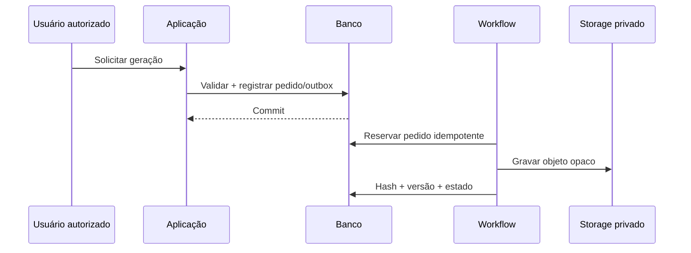

# Geração documental

Templates e variáveis são versionados. A aplicação valida pré-condições, registra uma solicitação idempotente e confirma a transação; workflow gera PDF determinístico, calcula hash, grava objeto privado e cria versão imutável.

Documento emitido nunca é sobrescrito. Retificação cria nova versão e preserva vínculo/hashes anteriores. Downloads exigem autorização, URL temporária e auditoria. ASO depende de conclusão médica humana válida e ausência de pendências obrigatórias.
