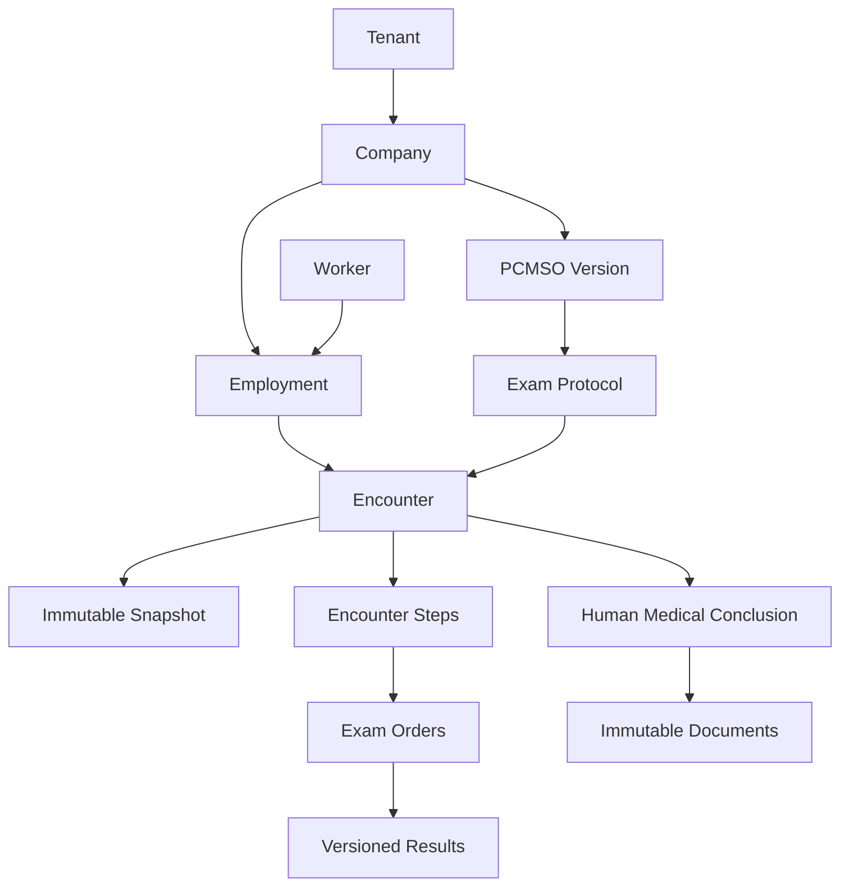

# Modelo de domínio

## Contextos delimitados

| Contexto | Responsabilidade | Entidades centrais |
|---|---|---|
| Plataforma | tenancy, unidades, identidade e acesso | tenant, clinic_unit, membership, role, permission |
| Ocupacional | empresas, vínculos, riscos e protocolo | company, worker, employment, pcmso_version, exam_protocol |
| Agenda | encaminhamento, importação e capacidade | referral, appointment, resource |
| Atendimento | snapshot, etapas, filas e eventos | encounter, encounter_snapshot, encounter_step, queue_ticket |
| Clínico | triagem, consulta e conclusão humana | triage_record, consultation, medical_conclusion |
| Exames | pedidos e resultados versionados | exam_order, exam_result_version |
| Documentos | templates, emissão e entrega privada | document_template, generated_document, document_version |
| Comercial | preço, orçamento e faturamento | price_list, quote, invoice, billing_item |
| Integrações | jobs, webhooks e eSocial | integration_job, webhook_delivery, esocial_event |
| Governança | auditoria, idempotência e observabilidade | audit_log, idempotency_key, outbox_event |

## Agregados e invariantes

- `Tenant`: raiz de isolamento; vínculos ativos definem acesso.
- `PcmsoVersion`: versão aprovada e utilizada é imutável.
- `Encounter`: criado atomicamente com snapshot, pedidos, etapas, primeiro ticket, auditoria e outbox.
- `EncounterSnapshot`: preserva protocolo, riscos, vínculo e versões usados.
- `MedicalConclusion`: decisão exclusiva de profissional autorizado; nunca inferida automaticamente.
- `GeneratedDocument`: emissão imutável; correção cria nova versão ligada à anterior.
- `Invoice`: valores usam snapshots comerciais e não alteram protocolo clínico.

