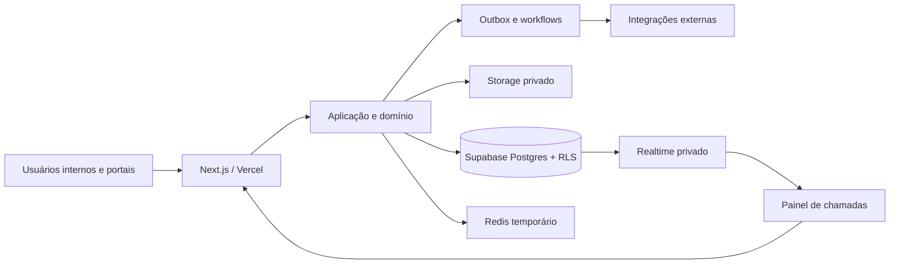

# Visão geral da arquitetura

## Contexto

Projeto greenfield para operação interna da Unimetra e evolução futura para SaaS. A arquitetura inicial é um monólito modular, implantável como uma aplicação Next.js, com limites de domínio explícitos e banco PostgreSQL compartilhado com isolamento lógico por tenant.

## Camadas

1. Interface: Server Components, formulários e estados de UX.
2. Entrada: Server Actions/Route Handlers, autenticação, autorização e Zod.
3. Aplicação: casos de uso, transações, idempotência e auditoria.
4. Domínio: invariantes puras e máquinas de estado.
5. Persistência: repositórios Drizzle, PostgreSQL, RLS e Storage privado.
6. Assíncrono: outbox após commit e workflows duráveis.

## Restrições

- Sem microserviços no MVP.
- Realtime, Redis e filas não são fonte oficial.
- Efeitos externos somente depois do commit.
- Componentes React não contêm regras clínicas críticas.
- Módulos clínicos dependem de validação profissional antes de produção.

## Qualidades prioritárias

Isolamento, integridade clínica, imutabilidade histórica, rastreabilidade, disponibilidade degradável, acessibilidade e operabilidade precedem aparência e velocidade.
