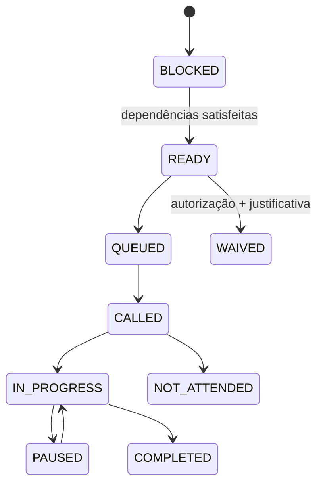

# Máquina de estados do atendimento

## Atendimento

`DRAFT → CHECKED_IN → IN_PROGRESS → AWAITING_MEDICAL_CONCLUSION → AWAITING_DOCUMENTS → COMPLETED`

Estados excepcionais: `PAUSED`, `CANCELLED` e `VOIDED` (retificação administrativa, nunca exclusão). Cancelamento/void exigem permissão, motivo e auditoria. Conclusão exige todas as etapas obrigatórias satisfeitas e decisão médica humana válida.

## Etapa

`BLOCKED → READY → QUEUED → CALLED → IN_PROGRESS → COMPLETED`

Alternativas controladas: `PAUSED`, `NOT_ATTENDED`, `CANCELLED`, `WAIVED`. `WAIVED` exige permissão/justificativa técnica; etapa concluída não é apagada. Transições usam controle otimista e backend.

Recálculo nunca altera snapshot original nem apaga eventos; cria delta versionado, novas etapas/pedidos e justificativa.
